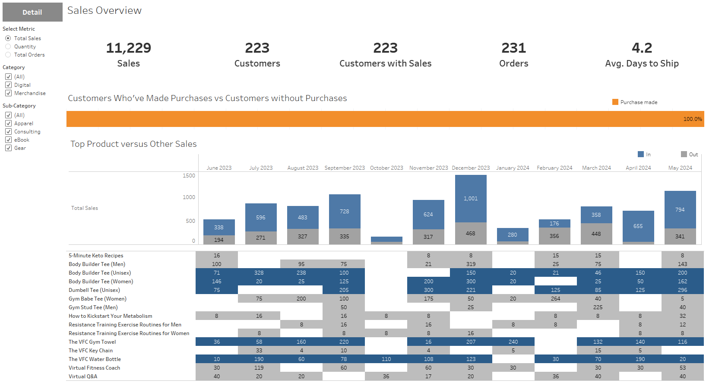
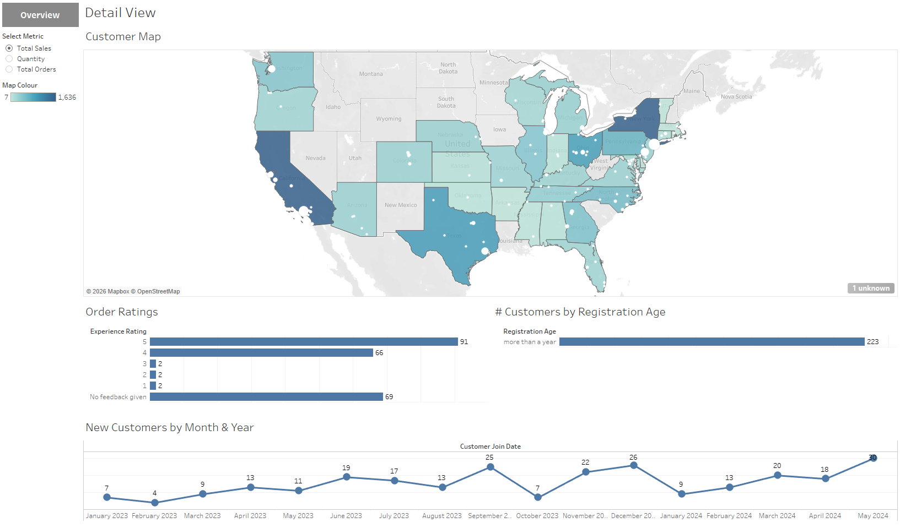

  

## Description

This project is an analysis of merchandise sales in years 2023/2024 from the provided datasets, followed by visualisation of gained insights in the Tableau environment.
It was built with a purpose of extracting important insights from the datasets and providing them in an easily readable manner.

The project served as a learning experience and a practical example of how analytics are performed in the real world.
During my work on this project I have learned how to use a new tool - Tableau, as an alternative to Power BI - in helping me analyse and visualise datasets.
It provided me with hands-on experience in working with Dimensions, Attributes, Measures, Parameters, and of course with building the Dashboards, to name a few.

## Usage

The project is provided in .twbx format, as well as with all the datasets in a separate folder.

_Merchandise_Sales_Dashboard.twbx_ - the project file containing assembled dashboards in separate tabs. 
Tableau must be installed on the OS to access the project. 
Simply download the .twbx file and import it into Tableau to access the data, it should work without the need of importing the datasets.

Dashboards have parameters which allow the user to dynamically adjust the type of data they can see.

### Preview of the project's dashboard

  
  

## Credits

This project was created as part of my studies of Data Analysis course on [ITOnlineLearning](https://www.itonlinelearning.com/)
